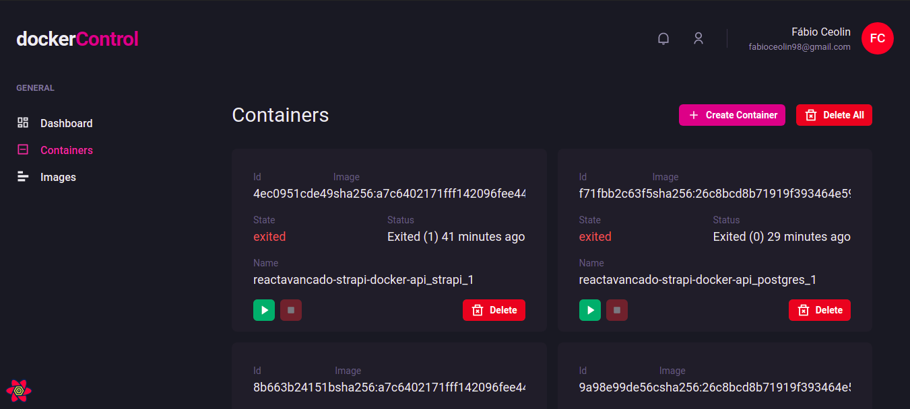

# dockerControl
## Sistema de gerenciamento e visualização  do docker



### Pré-requisitos

Antes de começar, você vai precisar ter instalado em sua máquina as seguintes ferramentas:
[Git](https://git-scm.com), [Node.js](https://nodejs.org/en/), [Yarn](https://yarnpkg.com/). 
Além disto é bom ter um editor para trabalhar com o código como [VSCode](https://code.visualstudio.com/)

### 🎲 Rodando o projeto

```bash
# Clone este repositório
$ git clone <https://github.com/fabioceolin/dockerControl.git>

# Acesse a pasta do projeto no terminal/cmd
$ cd dockerControl

# Instale as dependências
$ yarn install

# Execute a aplicação em modo de desenvolvimento
$ yarn dev

# A aplicação inciará na porta:3000 - acesse <http://localhost:3000>
```

### 🛠 Tecnologias

As seguintes ferramentas foram usadas na construção do projeto:

- [React](https://pt-br.reactjs.org/)
- [Next.js](https://nextjs.org/)
- [React Query](https://react-query.tanstack.com/)
- [TypeScript](https://www.typescriptlang.org/)

### Autor
---


Feito com ❤️ por Fábio Ceolin 👋🏽

[](https://www.linkedin.com/in/fabioceolin/) 
[](mailto:fabioceolin98@gmail.com)
